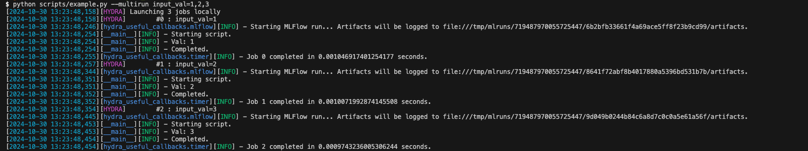

Hydra Callbacks
===============

Hydra callbacks I find useful for my research.





## Callbacks

```python
class MLFlowCallback
```
handles setting up MLFlow and starting/ending MLFlow runs around Hydra jobs.

The composed Hydra configuration is automatically logged as a YAML file.

Submitit log files are also logged if using the Hydra Submitit Launcher: (https://hydra.cc/docs/plugins/submitit_launcher/)

```python
class GitCleanCallback
```
checks that the current Git repository has no unstaged commits, to avoid unreproducible experiments.

```python
class TimerCallback
```
logs the wall-clock time for jobs.


Development
--------

```
conda env create --file environment/conda.yaml
pre-commit install
pip install -e .
```

## Additional resources

### hydra-callbacks: https://github.com/paquiteau/hydra-callbacks

High-quality implementations of several useful Hydra callbacks.

### hydra-ml-examples: https://github.com/joncarter1/hydra-ml-examples

Minimal working examples of machine learning experiment configuration using Hydra.
