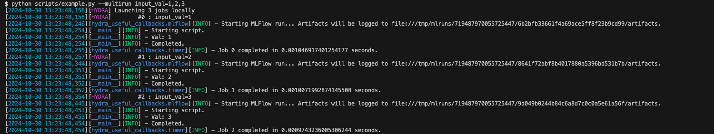

# Hydra Useful Callbacks

A small collection of [Hydra](https://hydra.cc) callbacks for ML research workflows: MLflow experiment tracking, git-clean enforcement, and per-job timing.




## Install

```bash
pip install git+https://github.com/joncarter1/hydra_useful_callbacks
# or, with uv:
uv add git+https://github.com/joncarter1/hydra_useful_callbacks
```

MLflow support requires `mlflow` (or `mlflow-skinny`) to be installed separately — the import in `hydra_useful_callbacks.__init__` is guarded so the package works without it.

## Callbacks

### `MLFlowCallback`

Sets up the MLflow connection, opens and closes runs around each Hydra job, sets `MLFLOW_RUN_ID` so application-side `mlflow.log_*` calls land in the right run, and uploads the composed Hydra config (plus Submitit stdout/stderr if running under the [Submitit launcher](https://hydra.cc/docs/plugins/submitit_launcher/)) as artifacts.

- Multirun jobs can be grouped as nested children under a shared parent run (toggle via `nested`).
- Hydra overrides for each job are logged as MLflow params.
- Set `run_id` to resume an existing run.
- Replays from retry-on-failure launchers (e.g. Modal `function.retries`, Submitit `--requeue`) resume the same MLflow run rather than allocating a fresh one per attempt — checkpoint and metric streams survive container preemption.

```yaml
# config/hydra/callbacks/mlflow.yaml
mlflow:
  _target_: hydra_useful_callbacks.MLFlowCallback
  experiment_name: my-experiment
  tracking_uri: file:///tmp/mlruns
  run_name: ${name}
  nested: true
```

### `GitCleanCallback`

Aborts the run if the git working tree has uncommitted changes, so every experiment is reproducible from its commit. Set `override: true` (e.g. in a debug profile) to bypass.

```yaml
# config/hydra/callbacks/git.yaml
git:
  _target_: hydra_useful_callbacks.GitCleanCallback
  override: "${oc.select: debug.active, False}"
```

### `TimerCallback`

Logs wall-clock duration per job. No configuration needed.

```yaml
# config/hydra/callbacks/timer.yaml
timer:
  _target_: hydra_useful_callbacks.TimerCallback
```

## Wiring up

Reference the callbacks from your top-level config:

```yaml
# config/main.yaml
defaults:
  - /hydra/callbacks:
      - git
      - mlflow
      - timer
  - _self_
```

A runnable example lives under [`scripts/`](scripts/).

## Development

```bash
uv sync                # install package + dev deps from uv.lock
pre-commit install
uv run pytest          # run the test suite
```

## Additional resources

- [`hydra-callbacks`](https://github.com/paquiteau/hydra-callbacks) — high-quality implementations of several useful Hydra callbacks.
- [`hydra-ml-examples`](https://github.com/joncarter1/hydra-ml-examples) — minimal working examples of ML experiment configuration with Hydra.
